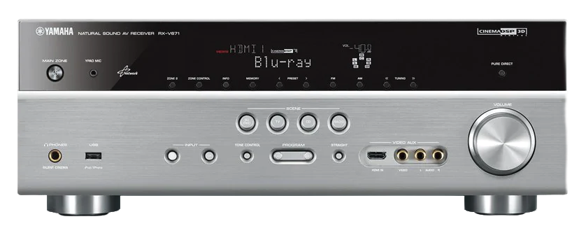

  

#### *"Everything should be made as simple as possible, but not simpler"* - Albert Einstein.

# YTuner

YTuner is a simple project inspired by [YCast](https://github.com/milaq/YCast) but rewritten from scratch and greatly improved.
Designed to replace vTuner internet radio service and dedicated to all users of AVRs made by Yamaha, Denon, Onkyo, Marantz, Grundig and others with built-in vTuner support.
If you own one (or even more) of the vTuner-enabled AVRs mentioned above and want to enjoy free internet radio stations on your device as before, and be sure that your device's streaming service won't suddenly end, you should consider using YTuner.

### Why

YCast is a great project, but my goal was to run a similar service on a very low-spec platform where python along with packages turned out to be too heavy and too slow.
Now, with YTuner you can enjoy improved functionality at full speed of ultra lightweight native app on operating systems such as:

* Linux, macOS, BSD, Solaris, Raspberry Pi OS, OpenWRT, Windows

and with selected CPU architecture:

* Intel i386, AMD64/x86_64, ARM/ARM64, PowerPC/PowerPC64, SPARC/SPARC64

or any others powered by cross-build abilities of [Free Pascal Compiler](https://www.freepascal.org/).

## Features

YTuner supports :
* Custom stations list files (aka MyStations) : YAML files (YCast compatible) or INI files.
* Great [Radio-browser.info](https://www.radio-browser.info) functionality.
* AVR bookmarks. Single bookmark for many AVRs or dedicated bookmark for each AVR (if you own more then one) with support of "add" and "del" operations sent from AVR devices. 
* Easy application configuration with ini files. 
* Optional SSL support for YTuner HTTPS web request.
* Radio stations logo images conversion/resize on the fly with couple of supported image formats (JPG,PNG,GIF,TIFF-optional) 
* Radio stations logo images optional cache.
* Radio-browser extensive caching with many options and auto refresh
  * UUIDs, data structures and stations cache (based on files or RAM storage).
  * Local DB based full cache of Radio-browser resources.
* Radio-browser advanced filtering and sorting (single config for many AVRs or dedicated configs for each AVR (if you own more then one))
* Radio-browser menu/submenu translator (for non-English users)

YTuner also has build in :
* Web service to support AVR requests.
* Optional DNS proxy service to intercept vtuner.com related DNS queries and others if needed.
* Maintenance service.

## Supported devices
***Theoretically, YTuner should work with most AVRs that support vTuner.***  
Now, the list of supported **and tested** devices below is short, but I hope it will expand with your help.

***Please test YTuner with your AVR and give me your feedback***. 

### Confirmed working
- Yamaha
  * Yamaha RX-V671
  * Yamaha RX-V673
  * Yamaha RX-V675 (Tested by [seldam](https://github.com/seldam). Thank you.)
  * Yamaha RX-V677 (Tested by Jordan / [jordandalley](https://github.com/jordandalley). Thank you.)
  * Yamaha RX-V777 (Confirmed by Jordan / [jordandalley](https://github.com/jordandalley). Thank you.)
  * Yamaha RX-V3900 (Tested by [BeryBurnout](https://github.com/BeryBurnout). Thank you.)
  * Yamaha RX-A820 (Tested by [Prideland](https://github.com/Prideland). Thank you.)
  * Yamaha RX-V500D (Tested by [qsm101](https://github.com/qsm101). Thank you.)
  * Yamaha DSP-Z7 (Tested by Beatrice / [TheBossME](https://github.com/TheBossME). Thank you.)
  * Yamaha NP-S2000  (Tested by [Ice64zzz](https://github.com/Ice64zzz). Thank you.)
- Marantz
  * Marantz NR1607 (Tested by [brietman](https://github.com/brietman). Thank you.)
  * Marantz M-CR611 (Tested by [aj-way](https://github.com/aj-way). Thank you.)
- Denon
  * Denon AVR-X1000 (Tested by [badekappe](https://github.com/badekappe). Thank you.)
  * Denon AVR-X1200W (Tested by [landolfi-us](https://github.com/landolfi-us). Thank you.)
  * Denon AVR-X1300W (Tested by [gibsnicht](https://github.com/gibsnicht). Thank you.)
  * Denon AVR-X2200W (Tested by [I-G-1-1](https://github.com/I-G-1-1). Thank you.)
  * Denon AVR-X3200W (Tested by [Larsvb0](https://github.com/Larsvb0). Thank you.)
  * Denon AVR-X3300W (Tested by [citronalco](https://github.com/citronalco). Thank you.)
  * Denon AVR-1912 (Tested by [HansJA](https://github.com/HansJA). Thank you.)
  * Denon AVR-2313 (Tested by [Stijn-Daniels](https://github.com/Stijn-Daniels). Thank you.)
  * Denon RCD-N7 (Tested by [breml](https://github.com/breml). Thank you.)
  * Denon RCD-N9 CEOL (Tested by [xaanur](https://github.com/xaanur). Thank you.)
  * Denon S-32 (Tested by [xaanur](https://github.com/xaanur). Thank you.)
- Pioneer
  * Pioneer N-30 (Tested by [stokifan](https://github.com/stokifan). Thank you.)
  * Pioneer N-50 (Tested by [vlad-6502](https://github.com/vlad-6502). Thank you.)
  * Pioneer N-70A (Tested by [SuperMyron](https://github.com/SuperMyron). Thank you.)
  * Pioneer X-HM71 (Tested by [Gilles94500](https://github.com/Gilles94500). Thank you.)
  * Pioneer XC-HM81 (Tested by [vlad-6502](https://github.com/vlad-6502). Thank you.)
  * Pioneer XC-HM82-K (Tested by [314ns](https://github.com/314ns). Thank you.)
  * Pioneer X-HM72-S (Tested by [NeoXTof](https://github.com/NeoXTof). Thank you.)
  * Pioneer VSX-923 (Tested by [Mr-Playground](https://github.com/Mr-Playground). Thank you.)
  * Pioneer PDX-Z9 (Tested by Freddy / [Freleo](https://github.com/Freleo). Thank you.)
  * Pioneer N-P01-K (Tested by [ManuISEN](https://github.com/ManuISEN). Thank you.)
  * Pioneer SC-79 (Tested by [LbL-GH](https://github.com/LbL-GH)). Thank you.)
  * Pioneer SC-1224 (Tested by [eefm](https://github.com/eefm)). Thank you.)
  * Pioneer TSX-528 (Tested by [WolfgangArndt](https://github.com/WolfgangArndt). Thank you.)
- Harman Kardon
  * Harman Kardon AVR 151 (Tested by [brmln](https://github.com/brmln). Thank you.)
  * Harman Kardon AVR 161 (Tested by [sivenjust](https://github.com/sivenjust). Thank you.)
  * Harman Kardon AVR 170 (Tested by [Onsl](https://github.com/Onsl). Thank you.)
  * Harman Kardon AVR 3770 (Tested by [phasperhoven](https://github.com/phasperhoven). Thank you.)
- Onkyo
  * Onkyo T-4070 (Tested by [J1So2](https://github.com/J1So2). Thank you.)
  * Onkyo TX-NR818 (Tested by [J1So2](https://github.com/J1So2). Thank you.)
- Pro-Ject
  * Pro-Ject Stream Box DS (Tested by [ArnoGr](https://github.com/ArnoGr). Thank you.)
  * Pro-Ject Stream Box DS net (Tested by [ArnoGr](https://github.com/ArnoGr). Thank you.)
  * Pro-Ject Stream Box DS+ (Tested by [ArnoGr](https://github.com/ArnoGr). Thank you.)
  * Pro-Ject Stream Box DSA (Tested by [ArnoGr](https://github.com/ArnoGr). Thank you.)
  * Pro-Ject Stream Box DS2T (Tested by [ArnoGr](https://github.com/ArnoGr). Thank you.)
  * Pro-Ject Stream Box RS (Tested by [ArnoGr](https://github.com/ArnoGr). Thank you.)
- T+A
  * T+A Music Player Balanced (Tested by [AlexViridi](https://github.com/AlexViridi). Thank you.)
- Noxon
  * Noxon iRadio 300 (Tested by [xaanur](https://github.com/xaanur). Thank you.)
  * Noxon Nova II (Tested by [J1So2](https://github.com/J1So2). Thank you.)
- ReVox
  * ReVox M51 (Tested by [roland68](https://github.com/roland68). Thank you.)
- TEAC
  * TEAC CR-H700 (Tested by [J-K-L-8617](https://github.com/J-K-L-8617). Thank you.)
- Libratone
  * Libratone Zipp Speaker (Tested by [ndx1905-github](https://github.com/ndx1905-github). Thank you. /Read https://github.com/coffeegreg/YTuner/discussions/68 and/or https://github.com/coffeegreg/YTuner/issues/58 to find out how to use it/)

## Installation
YTuner is a standalone application and in most cases it does not require additional services, frameworks, packages, virtual machines, libraries or tools to run properly (except optional OpenSSL and/or SQLite3 libraries).
You can download from [Releases](https://github.com/coffeegreg/YTuner/releases) a file specific to your operating system and CPU architecture or build YTuner from source (look at [Build](README.md#build) section).

After download (or build) save and extract files into prepared directory with granted read/write/execute privileges.
Remember that the credentials who will run YTuner must also have permission to open TCP port 80 and optionally UDP 53 (note below).

Now, you should have directory with some of the following subdirectories and files :

```
-- ytuner
 |-- config (subdir for config files) 
   |-- stations.ini  (if you want to use a ini file with your favorite radio stations) 
   |-- stations.yaml (if you want to use a yaml/yml file with your favorite radio stations)
   |-- avr.ini (common configuration file for all your AVRs)
   |-- bookmark.xml (common bookmark file for all your AVRs - only if one of your AVR support bookmark)
   |-- ...... (AVRs dedicated bookmark and config files)
 |-- cache (subdir for cache files)
   |-- rbuuids.txt (Radio browser UUIDs cache file)
   |-- ...... (other cache files)
 |-- db (subdir for databse cache file)
   |-- rb.db (Radio browser database cache file)
 |-- ytuner (or ytuner.exe for Windows)
 |-- ytuner.ini (YTuner important config file)
```
 Do not forget to add execute privileges to `ytuner` on linux/*nix systems with a command like `chmod +x ytuner`.  


### OpenSSL (optional)
If you want to use SSL to support YTuner HTTPS web request you have to get OpenSSL libraries.
- Most linux/*nix systems install OpenSSL by default. Otherwise, use your favorite package manager to get OpenSSL libraries or download them from [Github](https://github.com/openssl/openssl) or visit [OpenSSL Wiki](https://wiki.openssl.org/index.php/Binaries) for binary distributions source.   
- Windows users can download them from [Github](https://github.com/openssl/openssl) (follow [NOTES-WINDOWS.md](https://github.com/openssl/openssl/blob/master/NOTES-WINDOWS.md) instructions) or visit [OpenSSL Wiki](https://wiki.openssl.org/index.php/Binaries) for binary distributions source.
Make sure to get/build the correct version of the OpenSSL libraries with the correct bit length for your OS. 32-bit libraries are needed if you chose to use the 32-bit version of YTuner or 64-bit for the AMD64/x86_64 version of YTuner.
Finally, you should have 2 files:
  * OpenSSL 1.0.2 and earlier:
     + `ssleay32.dll` (or `libssl32.dll`) and `libeay32.dll`
  * OpenSSL 1.1.x:
     + 64-bit: `libssl-1_1-x64.dll` and `libcrypto-1_1-x64.dll`
     + 32-bit: `libssl-1_1.dll` and `libcrypto-1_1.dll`
  * OpenSSL 3.x.x:
     + 64-bit: `libssl-3-x64.dll` and `libcrypto-3-x64.dll`
     + 32-bit: `libssl-3.dll` and `libcrypto-3.dll`

and place them in your `ytuner` directory or anywhere in your system `PATH`.
Make sure your system has valid CA certificates.
>Tip: The YTuner should work with LibreSSL libraries as well.

### SQLite3 (optional)
If you want to forget about potential connection problems with `Radio-browser.info` while using YTuner and listening to your favorite stations, use one of the options `[catDB, catMemDB, catPermMemDB]` of the `RBCacheType` parameter in the `ytuner.ini` file to download the full contents of the `Radio-browser.info` resources once and store it in your local SQLite3 database.
Of course, only data that is useful for YTuner and AVR devices is downloaded and stored locally.
Due to the use of the very popular SQLite database, YTuner will need to use the library provided by the SQLite development team.
>! Important ! : Minimal version of SQLite library is 3.33.0 (2020-08-14)

>Tip: If you faced problems with the SQLite library, read [this](doc/SQLITE.md) description.

## Configuration

Your YTuner machine and AVR(s) have to have internet access. Make sure your firewall is properly configured if necessary.
### AVR
Set all DNS servers on your AVR config to your YTuner machine IP address.

### Router
Make sure that your YTuner machine is assigned a static IPv4 address.

### YTuner Web Service
Regardless of what operating system you use, you need to make sure that TCP port 80 is not being used by another application.
YTuner has a built-in multi-threaded web server that listens on TCP port 80 so you don't have to worry about its configuration and performance.
>Tip: In some special cases, it may be necessary to change the default TCP port 80 to another. You can do this by editing the YTuner ini file. See [Application configuration](README.md#application-configuration) section below.

### YTuner DNS Service
YTuner has a built-in multi-threaded DNS proxy server that listens on UDP port 53. This feature is optional and you can simple disable it and/or configure by editing configuration .ini file `ytuner.ini` (See [Application configuration](README.md#application-configuration) section below).
You can also use your favorite DNS server like `dnsmasq`.  
***Most important is to point `*.vtuner.com` domain to you YTuner machine and set all DNS servers on your AVR config to your YTuner machine IP address.***  
>Tip: In some special cases, it may be necessary to change the default UDP port 53 to another. You can do this by editing the YTuner ini file. See [Application configuration](README.md#application-configuration) section below.

### YTuner Maintenance Service
YTuner has a built-in maintenance service for diagnostic and future goals. 
At this moment you can use it to shut down YTuner service only.
>Tip: In most cases, you will not need this functionality. See [Application configuration](README.md#application-configuration) section below.

### Application configuration
YTuner is configured by simple `ytuner.ini` file.  
This file has the following capabilities:
https://github.com/coffeegreg/YTuner/blob/a87d0b45ec1987230d2455bc727d7a4407e6a856/cfg/ytuner.ini#L1-L180

YTuner's filtering and sorting functionality can be oriented by AVR device.
You can decide about it with `CommonAVRini` setting of `ytuner.ini`.
Common AVR config file `avr.ini` or other AVRs dedicated config files have the following capabilities:
https://github.com/coffeegreg/YTuner/blob/95c8f9d707faf45579063efba3066204e91607fd/cfg/avr.ini#L1-L163

_Please read the descriptions in both `.ini` files carefully._
### Custom stations
You can enable support for the stations list local file. Two types of files are supported:
* .ini file :
```
[Category one name]
  Station one name=http://url-of-station-one|http://url-of-station-one-logo
  Station two name=http://url-of-station-two|http://url-of-station-two-logo

[Category two name]
  Station three name=http://url-of-station-three|http://url-of-station-three-logo
  Station four name=http://url-of-station-four|http://url-of-station-four-logo
``` 
* .yaml / .yml file :
```
Category one name:
  Station one name: http://url-of-station-one|http://url-of-station-one-logo
  Station two name: http://url-of-station-two|http://url-of-station-two-logo

Category two name:
  Station three name: http://url-of-station-three|http://url-of-station-three-logo
  Station four name: http://url-of-station-four|http://url-of-station-four-logo
```
YTuner can convert and resize on the fly logo image from JPEG, PNG, GIFF and TIFF (optionaly) to JPEG (default) or PNG format. 
>Tip: URLs with logo station images are optional.

### Bookmark
What is the `Bookmark` ? `Bookmark` is what is mentioned in the AVR user's manual. `Bookmark` is operated only from the AVR device using the remote control. When you listen to a new station you can decide to put it into the `Bookmark` or want to remove it from it. All stations added in this way are visible in the `Bookmark` submenu of the AVR receiver.

If you AVR support `Bookmark` you can enable and use this YTuner functionality.
You can configure YTuner to use one common bookmark file (`bookmark.xml`) for all your AVR devices (if you have more then one) or each AVR will own its own bookmark file. 
See [Application configuration](README.md#application-configuration) section above.

## Running the application
### Linux / Unix (Solaris, BSD) / macOS
If you credentials meet all requirements mentioned above just go to your ytuner directory and start application or simple use `sudo` to execute application: 
```
$ sudo ./ytuner
```
Do not forget to add execute privileges to `ytuner` on linux/*nix systems with a command like `chmod +x ytuner`.
### Windows
>Tip: In this case you have to build your YTuner binaries yourself.

Simply execute `ytuner.exe`. 

### Docker container
If you are not familiar with building Docker containers you can read [this](doc/DOCKER.md).

## Build
You can use [Lazarus Free Pascal RAD IDE](https://www.lazarus-ide.org/) to build YTuner. 
Use the latest versions of IDE and FPC. Relevant project file is included.

### Dependencies
YTuner uses [Indy - Internet Direct](https://github.com/IndySockets/Indy) library to build its own binary files. Of course, YTuner binaries no longer need any additional libraries beyond the optional OpenSSL and/or SQLite3.
>Important: Use the latest version of Indy library to build YTuner.

## Summary
If you found this project useful, please star it. ⭐

## License
YTuner is licensed under MIT license.
See the [license.txt](LICENSE.txt) file for more details.
